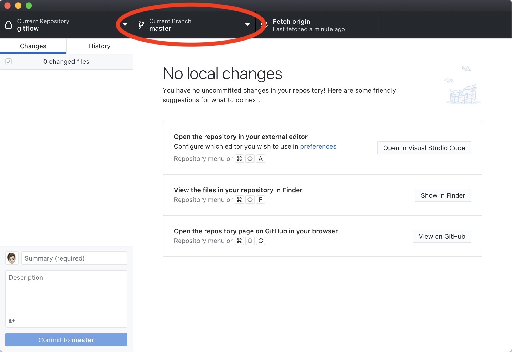
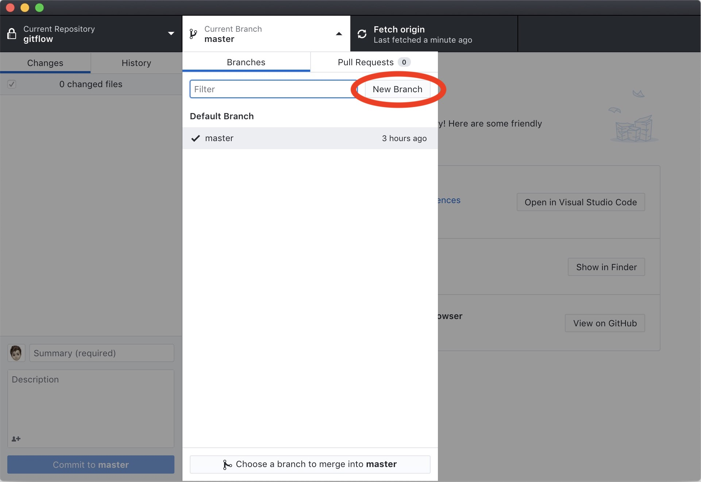
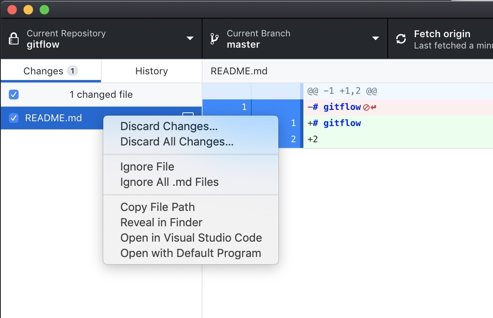

# Git Flow

For each programming project it is best practice to use a versioning tool like git. In this documenent I will outline on how to setup and use a program like git. The goal of this outline is to provide clairity and make sure everyone on a project uses the same standard

## Table of contents

- [How to setup git](#how-to-setup-git)
- [Cloning a respository](#cloning-a-repository)
- [Commits](#commits)
- [Branches](#branches)
- [Pull requests](#pull-requests)
- [FAQ](#faq)

## How to setup git

Installing git can be easy, but linking it to your github account can be a bit tricky. Here I'll outline on how to do both setup and config.

I recommend GitHub Desktop. You can download it [here](https://desktop.github.com/).
While you are installing you can login into your github account in the app by clicking "Sign in to Github.com", after you've signed in you're asked to configure git. Use your full name and email adress here, it is probably prefilled.
After that you can click on finish and github desktop is installed!

[back to top](#table-of-contents)

---

## Cloning a repository

In GitHub Desktop you can find a list of respositories, in this list search for the repository you want to download. By default it will store the repository in `C:\Users\<Your Username>\Documents\GitHub`.

[back to top](#table-of-contents)

---

## Commits
For each change you make you would want to commit. Commiting and pushing ensures your changes will not be lost, the changes will be pushed onto github and stored. Please make sure you commit as often as you can and make the commit message descriptive

[back to top](#table-of-contents)

---

## Branches
Everytime you start working on a feature of on a bugfix you want to make sure you're not on the master branch.

WARNING: YOU SHOULT NOT COMMIT CHANGES TO THE MASTER BRANCH.

You cannot push directly to the master branch.

### Naming
When branching out from the master you want to descriptivly name the branch. If you're planning on creating a feature your branchname should start with `feature/`. And if you're planning on fixing bugs you start with `hotfix/`. When in doubt use feature.

The second part of the branchname should describe what you're planning on doing. For example, when creating the login view in an application your branchname should be something like `feature/loginview`.

### Creation
BEFORE YOU CREATE A NEW BRANCH: Make sure you don't have any remaining changes left on the branch you're currently on. GitHub Desktop should show `No local changes`.

First you make sure your in the repository view. And click on the branch

Here you'll find a list of your local branches. Click on `New branch` to create a new branch to work on.

Here you need to enter a name using the naming scheme described above and click `Create Branch`.

You now have created a branch!

[back to top](#table-of-contents)

---

## Pull Requests

So, you've created your branch, made some commits and you're ready for everyone to see your great changes. So now we will create a pull request.

*A pull request can also be called a merge request*

Going to `https://github.com/WesVleuten/<projectname>/pulls` will show you the current pull requests on the project. Or when present on a repository page you can click here.

Click on `New pull request` this will redirect you to a new screen.

On that new screen click on compare and select **YOUR** branch in the compare field.

Now press the green `Create pull request` button and your pull request is ready for review!

[back to top](#table-of-contents)

---

## FAQ

Here are the most common issues and questions solved and answered.

### Switching branches

When switching branches any local changes will be transfered onto the switched to branch. However, this is not always possible, please be precausious and commit/stash/discard your changes before switching.

### Discard local changes

If you have made some changes you'd like to discard. You can right click your changes in github desktop and choose between discarding just the file you cliked or discrading all changes.

[back to top](#table-of-contents)

---